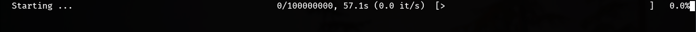

prog-rs
=======


A Rust library to help easily build a progress bar.




## Usage

First, add the following to your `Cargo.toml`:

```toml
[dependencies]
prog_rs = "0.1"
```

Next, add this to your crate root:

```rust
extern crate prog_rs;
```

To add a progress bar while iterating, just add `.progress()` behind your
iterator:

```rust
use prog_rs::prelude::*;

fn main() {
    for _ in (0..1_000).progress() {
        std::thread::sleep(std::time::Duration::from_millis(5));
    }
}
```

Some parameters can be tweaked using `with_` prefixed methods:

```rust
use prog_rs::prelude::*;

fn main() {
    for _ in (0..1_000)
        .progress()
        .with_prefix("Processing...")
        .with_output_stream(prog_rs::OutputStream::StdErr)
    {
        do_something();
    }
}
```
